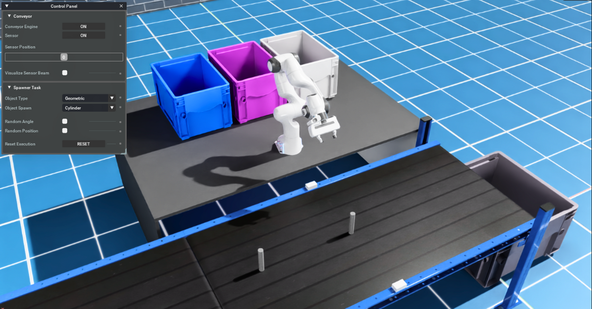
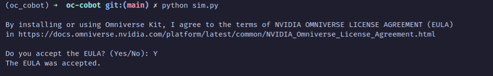
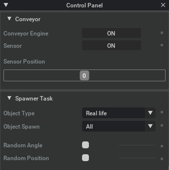

# OmniCraft Cobot Project

> 📌 This project is being developed in an Ubuntu environment and is not yet guaranteed to work with Windows.

A simulation scene built with NVIDIA Isaac Sim for experimenting with a robot arm (cobot) and the object detection model.



The goal of this project is to provide an example of how to create an NVIDIA Isaac Sim scene from scratch, control a robot manipulator, integration with ROS2 ecosystem and experimenting with computer vision algorithms.


## Roadmap
- ✅ Create the entire scene, implement the object spawner module, and simulate conveyor functionality.
- ⚠️ (**in-progress**) Example of a robot pick and place with MoveIt2
  > **Notes**: From our experiment in the current version, our project has failed to perform the pick and place task using MoveIt Task Constructor running on the bare metal host. A potential solution could be to run it within the Isaac ROS Docker environment. We are going to experiment it further and also investigating the compatibility of the MoveIt Task Constructor API with Isaac Sim v4.1.0.
- Example of a robot pick and place using the NVIDIA Isaac Sim Core API.

- Apply object detection algorithm.

## Changelog
For detailed information on our current features, updates and changes, see the [Changelog](./CHANGELOG.md).


## Project Files and Directories
- `sim.py`: Main entry point, a standalone workflow script to launch the NVIDIA Isaac Sim app and run the `oc.cobot.conveyor` extension.  
- `assets/`: Contains all USD models composed in the scene.
- `docs/`: Stores the project's files and documentation.
- `exts/`: Project's Isaac Sim extension. You can add new extensions to suit your work here.
  - `oc.cobot.conveyor`: An extension that contains the simulation logic, scene setup of the conveyor scene.
  - `oc.cobot.simple_scene`: An extension that demonstrates how to control a robot manipulator using Isaac Sim API (without ROS). [See the usage](./exts/oc.cobot.simple_scene/docs/README.md)
- `ros_ws/`: Contains ros2 packages using in this project.
  - `cobot`: Application logic to control robot. 
  - `moveit_task_constructor`: A copy of the moveit_task_constructor package from the MoveIt2 Humble branch. It is required for MoveIt Task Constructor and is not yet available through apt.
  - `panda_description`: Use for customize Franka robot model.
  - `panda_moveit_config`: Use for customize Franka robot moveit2 configuration.
- `utils/`: Shared utility functions that are used frequently in the project.

## Installation

### 1. ROS2 & MoveIt2 Installation
1. If you don't have ROS2 & MoveIt2 in your system, follow this guide [Install ROS2 humble in Ubuntu](https://docs.ros.org/en/humble/Installation/Ubuntu-Install-Debs.html) first to install ROS2 in your system.
2. Then, install MoveIt2 by running this command:
   ```sh
   sudo apt install ros-humble-moveit
   ```
   
### 2. Project Installation
1. Install Conda by following the [official Conda installation guide for Linux](https://conda.io/projects/conda/en/latest/user-guide/install/linux.html). Use the **Anaconda Distribution installer for Linux**.

2. Clone the project and change the directory to the `oc-cobot` root:

    ```sh
    git clone https://github.com/bemunin/oc-cobot.git
    cd oc-cobot
    ```

3. Make a copy of `environment.yml` and rename it to `environment.local.yml`.

4. Inside the `environment.local.yml` file, change `<user>` in the `prefix:` key to match your Anaconda path.

5. At the root of the project directory, run this command to create the `oc_cobot` Conda environment:

    ```sh
    conda env create -f environment.local.yml
    ```

## Getting Started

### 1. Run Simulation 

1. Activate the `oc_cobot` Conda environment:

    ```sh
    conda activate oc_cobot
    ```

3. Run the `sim.py` script to start the simulation:

    ```sh
    python sim.py
    ```

    ⚠️ **Note:**
    - The first time it runs, it might take some time to load the program and scene as NVIDIA Isaac Sim has not yet cached the data.
    - There will be a prompt from NVIDIA asking you to agree with the NVIDIA License. Type `Y` and press Enter to accept. You only need to do this once.
      

4. After the simulation starts, you can interact with the scene via the control panel on the top left.

   

### 2. Run MoveIt2
1. Goto directory `ros_ws`. Then build and source `ros_ws`
2. Ensure that simulation scene is loaded in Isaac Sim. Then run this command in the first terminal to launch all MoveIt2 and it required nodes.
    ```sh
    ros2 launch cobot move.launch.py is_use_mtc:=true hardware_type:=isaac
    ```
    - is_use_mtc: is a flag to use MoveIt Task Constructor. Accept string of "true" or "false"
    - hardware_type: Accept string of "isaac" or "mock_components". 
      - isaac = Control robot in Isaac Sim
      - mock_components = Running only in MoveIt2 Planning Scene.
3. In another terminal, run this command to start pick and place with Moveit Task Constructor
  ```sh
    ros2 launch cobot pickplace.launch.py
  ```

## Simulation Customization
You can customize conveyor scene behavior before running `sim.py` by creating `config.local.toml` (see example in default configuration `config.toml`)

### Spawner Module Configuration

This config section in `config.toml` is used for customize object spawner module in `oc.cobot.conveyor` extension.
```
[spanwer]
object_type = "geometric" 
object_spawn= "cylinder.usd"
```

- _object_type_: Object type to spawn between "real_life" and "geometric" 
- _object_spawn_: Filename of object to force spawn.  See object's filename in directory `/assets/objects`

### Conveyor Module Configuration

This config section in `config.toml` is used for customize conveyor module in `oc.cobot.conveyor` extension.
```
[conveyor]
spawn_pos_x_offset = 1.3
```
- _spawn_pose_x_offset_: Adjust location to the spawned object on the conveyor in x-axis. Value is float type and its unit is meter.