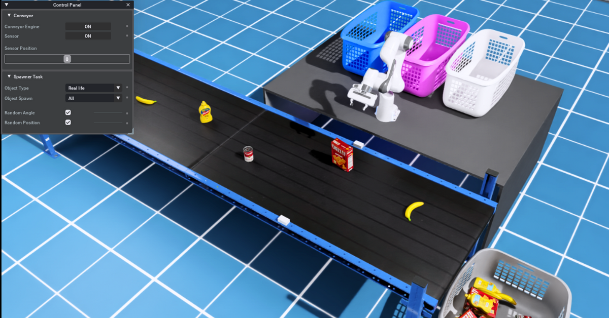

# OmniCraft Cobot Project

An simulation scene built with NVIDIA Isaac Sim for experimenting with the robot arm (cobot) and YOLO object detection model.

The goal of this project is to provide an example of how to create a NVIDIA Isaac Sim scene from scratch, control robot manipulator and  use it for experimenting with modern computer vison algorithm.

## Changelog
For detailed information on updates and changes, see the [Changelog](./CHANGELOG.md).

## Getting Started

## Project Files and Directories
- `sim.py`: Main entry point, a standalone workflow script to launch the NVIDIA Isaac Sim app and run `oc.cobot.yolo` extension.  
- `assets/`: Contains all USD models composed in the scene.
- `docs/`: Stores the project's files and documentation.
- `exts/`: Project's Isaac Sim extension. You can add new extensions to suit your work here.
  - `oc.cobot.yolo`: An extension that contains the application logic of this example  
- `launch/`: Contains sub-functions used in `sim.py` to launch the simulation application.
- `utils/`: Shared utility functions that are used frequently in the project.
